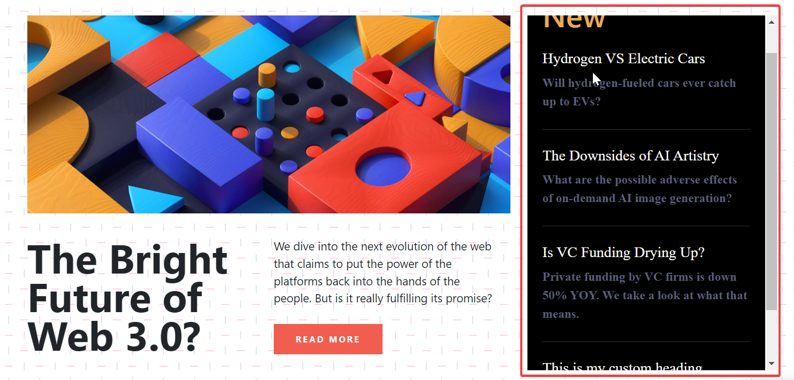

# 1. firstAssignmentImage

### 1.task1Output.png


### Answer

```
    const nav_ul_ele = document.querySelector("nav>ul"); 
    const new_li = document.createElement("li");
    const hire_ele = document.createElement("a");
    hire_ele.href = "#"; 
    hire_ele.textContent = "Hire Me"; 

    new_li.appendChild(hire_ele); 
    nav_ul_ele.appendChild(new_li);

```

### 2. task2Output.png


### Answer
```
    const contacts_li = document.querySelector("nav>ul>li:nth-child(3)");
    contacts_li.textContent = "Projects";

```

### 3.task3Output.png


### Answer
```
    const last_span = document.querySelector(".hero-left-section>p>span:last-child");
    last_span.textContent = "iNeuron Intelligence Pvt Ltd.";

```

### 4.task4Output.png


### Answer
```
    const imge_ele = document.querySelector(".hero-right-section>img");
    imge_ele.src = "./change_img.png";


```


### 5.task4Output.png


### Answer
```
    const btn_container = document.querySelector(".hero-right-section-btns");

    const support_me = document.createElement("button");

    support_me.textContent = "Support Me";
    
    btn_container.appendChild(support_me);

```


# 2. secondAssignmentImage

### 1.task1Output.png


### Answer
```
    const accordian_h3 = document.querySelectorAll(".accordian>h3");

    for(let i = 0; i<accordian_h3.length; i++){
        accordian_h3[i].style.backgroundColor="#d1c4e9";

        if(accordian_h3[i].textContent == "Achievement" || accordian_h3[i].textContent == "Hobbies"){ 
            accordian_h3[i].click();

        }

}

```

### 2. task2Output.png


### Answer
```
    const accor = document.createElement("div");
    accor.className="accordian"; 

    const header_3 = document.createElement("h3");

    header_3.textContent = "Skills";

    const para_skill = document.createElement("p"); 
    para_skill.textContent = "I possess a very good command over the  full stack development technologies like mern which can be seen in my work over github";


    accor.appendChild(header_3); 
    accor.appendChild(para_skill);
    para_skill.style.display = "block";

    const accordian_par = document.querySelector(".accordian-wrapper");

    accordian_par.appendChild(accor);

    const accordian_h3 = document.querySelectorAll(".accordian>h3");

    for(let i = 0; i<accordian_h3.length; i++){
        accordian_h3[i].style.backgroundColor="#d1c4e9";

    }

    header_3.addEventListener("click", () => {
        let para = header_3.nextElementSibling;
        if (para.style.display === "block") {
        para.style.display = "none";
        } else {
        para.style.display = "block";
        } })

```

# 3. thirdAssignmentImage
### 1. task1Output.png


```
let main_left = document.querySelector(".mainLeft>form");
let left_main_name = main_left.querySelector(".enterName");
left_main_name.placeholder = "FSJS 2.0";

let left_main_email = main_left.querySelector(".enterMail");
left_main_email.placeholder = "fsjs@ineuron.ai";

let main_left_message= main_left.querySelector(".enterMessage"); 
main_left_message.placeholder = "Hello World";


let main_right = document.querySelector(".mainRight>form");
let right_main_name = main_right.querySelector(".userName");
right_main_name.placeholder = "FSJS 2.0";

let right_main_email = main_right.querySelector(".userEmail");
right_main_email.placeholder = "fsjs@ineuron.ai";

let main_right_message= main_right.querySelector(".userMessage"); 
main_right_message.placeholder = "Hello World";


```


# 04_DOM project


```
    const changeColor = function(stat_class_name, level_name){

        const score_card = document.querySelector(stat_class_name); 

    
        score_card_background_color = document.querySelector(level_name).style.color;
        const bg_color = getComputedStyle(document.querySelector(level_name)).color;
        score_card.style.backgroundColor = bg_color;

        const divs_in_stat = score_card.querySelectorAll("div"); 

        for(let i = 0; i< divs_in_stat.length; i++){
            divs_in_stat[i].style.color = "white";
        }
    }

    changeColor(".clash-card__unit-stats--barbarian", ".clash-card__level--barbarian");

    changeColor(".clash-card__unit-stats--archer", ".clash-card__level--archer");

    changeColor(".clash-card__unit-stats--giant", ".clash-card__level--giant"); 

    changeColor(".clash-card__unit-stats--goblin", ".clash-card__level--goblin");

    changeColor(".clash-card__unit-stats--wizard", ".clash-card__level--wizard");


```


# 05_DOM Project


```
    let recips = document.getElementsByClassName('recipe-text'); 
for(let i =0; i < recips.length; i++){
    recips[i].style.color = "lightpurple";
}

const card = document.createElement("div"); 
card.className = "card"; 

const card_anchor = document.createElement("a"); 
card_anchor.href= ""; 
card_anchor.className = "recipe-text";


const img_food = document.createElement("img"); 
img_food.src = "./img/recipe-1.jpeg"; 
img_food.className = "recipe-img";

const heading5 = document.createElement("h5");
heading5.textContent = "Chicken"; 
heading5.className = "recipe-name";

const para = document.createElement("p");
para.textContent = "Prep : 15min | Cook : 30min"; 
para.className = "recipe-disp";

card_anchor.appendChild(img_food); 
card_anchor.appendChild(heading5);
card_anchor.appendChild(para); 

card.appendChild(card_anchor); 

const recipe_gallary = document.querySelector(".recipe-gallery"); 

recipe_gallary.appendChild(card);

```


# 06_DOM Project_1


```
    const logo = document.querySelector("header>img"); 
    logo.src = "./assets/ineuron-logo.png";

```

# 06_DOM Project_2 


```
    const app_price = document.querySelector(".app_price>span");
    app_price.textContent = "$10";

```


# 07 DOM P7 
## Ass7.1-After


```
    const list_of_anchors = document.querySelectorAll("a"); 

    for(let i = 0 ; i< list_of_anchors.length; i++){
        if(list_of_anchors[i].textContent.includes("2.0")){
            list_of_anchors[i].remove();
            
        }

    }

```

## Ass7.2-After 


```

    const inp_box = document.querySelector(".main__form-input");
    inp_box.value = "Ineuron"; 
    const btn = document.querySelector('.main__form-btn');
    btn.disabled = false; 
    btn.click();

```


# DOM P8 
## ass8.1


```
   const addQA = function(title, answer){
        const aside_box = document.querySelector('aside');

        const new_header = document.createElement('h2');

        new_header.className = 'new-head';

        new_header.textContent = title; 

        const new_para = document.createElement('p');

        new_para.className = "new-p";

        aside_box.appendChild(new_header); 
        aside_box.append(new_para);

        aside_box.style.overflowY = 'scroll';

        new_para.textContent = answer;

        const hr = document.createElement('hr'); 
        aside_box.appendChild(hr);


    }

    addQA('This is my custom heading', 'This is my  custom header');

```

## ass 8.2 
##### Both the image 8.2 befgore and 8.2 after look the same can't find out the difference. 


## ass 8.3 


```
    const menu_button = document.querySelector(".navbar-toggler");
    menu_button.addEventListener('click', (e)=>{
        const  menuList = document.getElementById("navbarTogglerDemo01");
        menuList.style.display = (menuList.style.display == "block")?"none":"block";
                            
    });

```

# DOM 09

## ass9.1


```
    const title = document.querySelector(".caption>.title");
    title.style.color = "red";

```

## ass 9.2 

```
    const add_to_cart  = document.querySelector(".add-to-cart");

    add_to_cart.style.backgroundColor  = "#d81b60";

    add_to_cart.addEventListener('mouseover', ()=>{
        
        add_to_cart.style.backgroundColor="#ad1457";                     
                                
    });

    add_to_cart.addEventListener('mouseout', ()=>{
        
        add_to_cart.style.backgroundColor="#d81b60";                     
                                
    });
```
